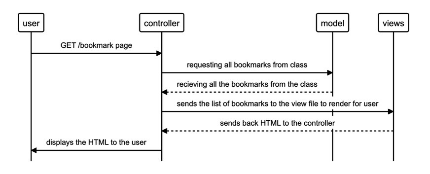

# bookmark-pair

``` 

As a user
To visit websites that I like quickly
I want to be able to see a list of all my created bookmarks 
```



```
Connect to psql
Create the database using the psql command CREATE DATABASE bookmark_manager;
Connect to the database using the pqsl command \c bookmark_manager;
Run the query we have saved in the file 01_create_bookmarks_table.sql
```